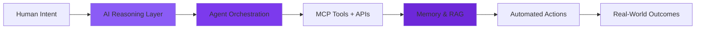

<div align="center">

<!-- Hero Banner -->


</div>

<br/>

<div align="center">

### Building AI Systems That Think, Decide, and Act


</div>

<br/>

<div align="center">

[](https://github.com/Tayyaba-Ramzan)
[](https://www.linkedin.com/in/tayyabaRamzan/)
[](mailto:tayyabaramzan.it@gmail.com)


</div>

---

## 👩‍💻 About Me

I engineer **production-grade AI systems** that bridge reasoning and action — not proof-of-concepts, but real software that integrates LLMs, agents, memory, and tools to automate complex workflows and execute autonomous tasks.

My work spans the **full AI application stack**: from multi-agent orchestration and RAG pipelines to MCP tool integration and cloud-native deployments. I build systems where AI doesn't just respond — it understands context, retrieves knowledge, makes decisions, and takes real-world actions.



**Current Focus:** `Agentic AI` `Multi-Agent Systems` `Model Context Protocol` `RAG Architectures` `AI Workflow Automation` `Production AI Infrastructure`

---

## 🚀 Featured Engineering Projects

### 🤖 Autonomous AI Employee — Silver Tier
**Digital FTE with Multi-Tool Reasoning & Workflow Automation**

A production-ready autonomous AI employee that handles approval workflows, task execution, and cross-service orchestration using advanced AI reasoning and tool-calling capabilities. Built for real business automation scenarios.

**Engineering Highlights:**
- 🧠 Advanced prompt engineering with dynamic instruction chains
- 🔧 Multi-tool integration (API calls, database ops, file handling)
- 🔄 State management across async workflow steps
- 🛡️ Error handling, retry logic, and guardrails
- 📊 Workflow observability and execution tracking

**Stack:** `Python` `Claude API` `Tool Calling` `Workflow Automation` `API Integration` `Async Processing`

[](https://github.com/Tayyaba-Ramzan/Autonomous-AI-Employee-Silver-Tier)

---

### ⚙️ Agent Factory — Canva × LinkedIn System
**End-to-End AI Content Pipeline with MCP Integration**

Intelligent content generation and design automation system that orchestrates multiple AI agents using Model Context Protocol (MCP). Combines reusable skills, Claude Code workflows, and Canva MCP tools for automated content creation and social media publishing.

**Engineering Highlights:**
- 🎯 Multi-agent coordination with skill composition
- 🎨 MCP-based tool calling for design automation
- 🔗 LinkedIn API integration for automated publishing
- 📋 Reusable agent skill library architecture
- 🔄 End-to-end pipeline: ideation → design → publish

**Stack:** `Claude Code` `MCP` `Canva API` `LinkedIn API` `Agent Orchestration` `Python`

[](https://github.com/Tayyaba-Ramzan/Agent-Factory-Canva-Linkedin-System)

---

### 🧩 Multi-Agent Systems Research
**Exploring Advanced Agent Patterns & Coordination**

Comprehensive exploration of multi-agent architectures including tool-calling patterns, dynamic instruction routing, web search integration, guardrails implementation, and coordinated task execution across specialized agents.

**Engineering Highlights:**
- 🛠️ Tool calling & function execution patterns
- 🌐 Web search integration with RAG
- 🛡️ Guardrails & safety constraints
- 🔀 Agent coordination protocols
- 📚 Dynamic context management

**Stack:** `Python` `OpenAI Agent SDK` `LangChain` `Tool Calling APIs` `Vector DBs`

[](https://github.com/Tayyaba-Ramzan/Multi-Agent-Systems)

---

### ☁️ Full-Stack Kubernetes Hackathon
**Cloud-Native Application with Container Orchestration**

Production-ready full-stack application demonstrating modern cloud-native patterns with Docker containerization and Kubernetes-based orchestration, load balancing, and auto-scaling.

**Engineering Highlights:**
- 🐳 Multi-stage Docker builds
- ☸️ Kubernetes manifests (Deployments, Services, Ingress)
- 📦 Microservices architecture
- 🔄 CI/CD pipeline integration
- 🌐 Load balancing & health checks

**Stack:** `TypeScript` `Next.js` `Docker` `Kubernetes` `Helm` `Cloud Infrastructure`

[](https://github.com/Tayyaba-Ramzan/Hackathon-II-FullStack-K8s)

---

## 🛠️ Technology Stack

<div align="center">

### AI & Agentic Systems


### Frontend Development


### Backend & APIs


### Databases & Storage


### Cloud & DevOps


</div>

<br/>

<div align="center">


</div>

---

## 📊 Development Activity

<p align="center">   </p> <p align="center">  </p> <table> <tr> <td align="center" width="50%">  </td> <td align="center" width="50%">  </td> </tr> </table <p align="center">  </p>

## 🐍 Contribution Snake <p align="center">  </p>


---

## 🎯 Current Focus & Exploration

<table>
<tr>
<td width="50%">

### 🔬 Research Areas
- Agentic AI architectures
- Multi-agent orchestration patterns
- MCP ecosystem & tool development
- Advanced RAG techniques
- Context engineering & memory systems
- AI workflow automation

</td>
<td width="50%">

### 🏗️ Building
- Production AI infrastructure
- Autonomous agent frameworks
- LLM application pipelines
- AI-powered SaaS tools
- Developer productivity automation
- Intelligent API integrations

</td>
</tr>
</table>

---

## 💭 Engineering Philosophy

<div align="center">

### AI systems should be **reliable**, **observable**, and **production-ready**

</div>

```text
┌─────────────────────────────────────────────────────────────┐
│                                                             │
│  ✓ Design for failure — implement retries, fallbacks,      │
│    and graceful degradation                                 │
│                                                             │
│  ✓ Make AI decisions transparent — log reasoning,          │
│    tool calls, and confidence scores                        │
│                                                             │
│  ✓ Prioritize security — validate inputs, sanitize         │
│    outputs, implement guardrails                            │
│                                                             │
│  ✓ Build modular — composable agents, reusable tools,      │
│    clear abstractions                                       │
│                                                             │
│  ✓ Test rigorously — unit tests, integration tests,        │
│    LLM evaluation frameworks                                │
│                                                             │
│  ✓ Optimize for latency — streaming, caching, parallel     │
│    execution                                                │
│                                                             │
│  ✓ Human-in-the-loop — AI augments, doesn't replace        │
│                                                             │
└─────────────────────────────────────────────────────────────┘
```

> **"The best AI systems don't just answer questions —**  
> **they understand context, retrieve knowledge, reason about actions, and execute with reliability."**

---

## 🤝 Let's Build Together

I'm actively exploring **agentic AI**, **multi-agent systems**, and **production LLM applications**. If you're working on:

- 🤖 Autonomous agent frameworks
- 🧠 RAG architectures & knowledge systems
- 🔧 MCP tool development
- 🏗️ AI infrastructure & DevOps
- 🚀 AI-powered SaaS products
- 📚 LLM application patterns

**Let's connect and collaborate.**

<div align="center">

<br/>

[](https://www.linkedin.com/in/tayyabaRamzan/)
[](mailto:tayyabaramzan.it@gmail.com)
[](https://github.com/Tayyaba-Ramzan)

<br/>

### 💡 Open to collaboration on innovative AI projects

<br/>

</div>

---

<div align="center">


</div>
